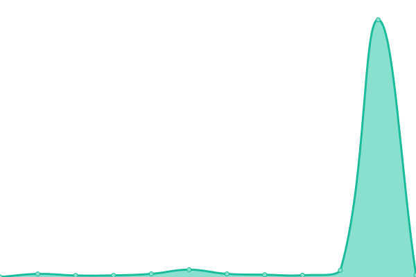

# [📈 Live Status](https://IceDotBergs.github.io/upptime-zuma3): <!--live status--> **🟩 All systems operational**

This repository contains the open-source uptime monitor and status page for [John The Polar Bear](https://IceDotBergs.github.io/upptime-zuma3), powered by [Upptime](https://github.com/upptime/upptime).

With [Upptime](https://upptime.js.org), you can get your own unlimited and free uptime monitor and status page, powered entirely by a GitHub repository. We use [Issues](https://github.com/IceDotBergs/upptime-zuma3/issues) as incident reports, [Actions](https://github.com/IceDotBergs/upptime-zuma3/actions) as uptime monitors, and [Pages](https://IceDotBergs.github.io/upptime-zuma3) for the status page.

<!--start: status pages-->
<!-- This summary is generated by Upptime (https://github.com/upptime/upptime) -->
<!-- Do not edit this manually, your changes will be overwritten -->
<!-- prettier-ignore -->
| URL | Status | History | Response Time | Uptime |
| --- | ------ | ------- | ------------- | ------ |
|  [ULP](https://ulp.zumasales.com/) | 🟩 Up | [ulp.yml](https://github.com/IceDotBergs/upptime-zuma3/commits/HEAD/history/ulp.yml) | 

 1239ms
     
 | 

<a href="https://IceDotBergs.github.io/upptime-zuma3/history/ulp">96.52%</a>
    

|  [Zuma CA](https://www.zuma.ca/) | 🟩 Up | [zuma-ca.yml](https://github.com/IceDotBergs/upptime-zuma3/commits/HEAD/history/zuma-ca.yml) | 

 414ms
     
 | 

<a href="https://IceDotBergs.github.io/upptime-zuma3/history/zuma-ca">100.00%</a>
    

|  [Zuma Sales](https://zumasales.com/) | 🟩 Up | [zuma-sales.yml](https://github.com/IceDotBergs/upptime-zuma3/commits/HEAD/history/zuma-sales.yml) | 

 333ms
     
 | 

<a href="https://IceDotBergs.github.io/upptime-zuma3/history/zuma-sales">100.00%</a>
    

|  [Lift Pros](https://scissorliftboomlift.com/) | 🟩 Up | [lift-pros.yml](https://github.com/IceDotBergs/upptime-zuma3/commits/HEAD/history/lift-pros.yml) | 

 593ms
     
 | 

<a href="https://IceDotBergs.github.io/upptime-zuma3/history/lift-pros">100.00%</a>
    

|  [TIP](https://tip.zumasales.com/) | 🟩 Up | [tip.yml](https://github.com/IceDotBergs/upptime-zuma3/commits/HEAD/history/tip.yml) | 

 1526ms
     
 | 

<a href="https://IceDotBergs.github.io/upptime-zuma3/history/tip">96.82%</a>
    

|  [ZEOS](https://zeos-xi.vercel.app/n) | 🟩 Up | [zeos.yml](https://github.com/IceDotBergs/upptime-zuma3/commits/HEAD/history/zeos.yml) | 

 739ms
     
 | 

<a href="https://IceDotBergs.github.io/upptime-zuma3/history/zeos">100.00%</a>
    

<!--end: status pages-->

[**Visit our status website →**](https://IceDotBergs.github.io/upptime-zuma3)

## 📄 License

- Powered by: [Upptime](https://github.com/upptime/upptime)
- Code: [MIT](./LICENSE) © [Anand Chowdhary](https://anandchowdhary.com), supported by [Pabio](https://pabio.com)
- Data in the `./history` directory: [Open Database License](https://opendatacommons.org/licenses/odbl/1-0/)
